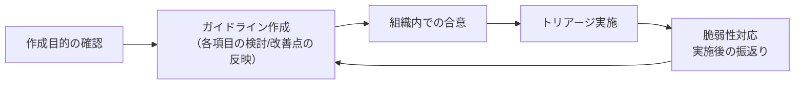

# はじめに

## 前文

本ドキュメントは「**組織が脆弱性に適切に対応することを目的として、脆弱性診断を実施した際に提供された報告書に記載された脆弱性対応の優先順位付け（トリアージ）を行うために、その組織に適したトリアージガイドラインを作成するための手引き**」です。

組織においてセキュリティ対応を行うためのリソースは限りあるものです。そのため、発見されたすべての脆弱性に対応できるとは限りません。限りあるリソースを最大効率で活用するためには、適切に優先順位を付けて対応していく必要があります。

優先順位をつけるにあたり、以下の二点について考慮する必要があります。

- **適切なトリアージを行う為には明確な判断基準が必要**
- **脆弱性の取扱はあなた自身で判断する必要がある**

適切なトリアージを行うためには明確な判断基準が必要です。
もともと「トリアージ（Triage）」というのは、大事故や大規模災害などで多数の傷病者がいる状況において、傷病の緊急度や重症度に応じて優先度を決めることです。災害医療では標準化が図られていて、最大効率を得るためにさまざまな基準が決められています。
サイバーセキュリティの分野でも、インシデントハンドリングにおいてトリアージを適切に行うためには、あらかじめトリアージのための判断基準を明確に定めておく必要があります。
ただ、トリアージの判断基準は「守るべきものは何か？」という基本的な組織の活動ポリシーによって変わるため、組織ごとに適切なトリアージガイドラインは異なります。

脆弱性の取扱はあなた自身で判断する必要があります。
脆弱性診断実施時の報告書には、発見された脆弱性の「リスクの大きさ」についての記載があります。高・中・低の表記や数値によってリスクの大きさが示されていますが、その記載はあくまで脆弱性そのものの脅威の大きさです。
どういうシステムに存在する脆弱性なのか、そのシステムはどのくらい重要なのか、攻撃コードは公開されているのか、すでに攻撃は起きているのか、といった状況や環境によっても対応の優先順位は変わってきます。
そのため、脆弱性診断で発見された脆弱性をどう取り扱うのか、外部から報告された脆弱性をどう取り扱うのかは、あなたの組織自身で判断する必要があります。

本ドキュメントは、トリアージについてこれから取り組むという組織や、ある程度取り組んでいるが自社に明確なガイドラインがない、見直したいといった組織が、その組織に適したトリアージガイドラインを作成して頂くことを目的としています。

## なぜ脆弱性のトリアージが必要なのか

顕在化した脆弱性のすべてを修正できるのが理想ですが、対応する資源（人的、環境、お金）は無限ではありません。また、すべてを修正しようとして、その検討に時間がかかりすぎ、その結果早期に修正すべきものまでが後回しになってしまうことがあります。

そのため、脆弱性のトリアージ（対応の優先度付け）というのは非常に重要なものとなります。

なお、トリアージを行う目的は対応のための単なる優先順位付けだけではありません。それは、脆弱性診断で報告を受けた脆弱性やベンダーから公表された脆弱性のすべてが対応すべきものとは限らないからです。

## 脆弱性対応の判断フロー

脆弱性の認知/検知時の対応判断は、以下のフローのように、「①実際に脆弱性の影響を受けるのか、その範囲はどの程度なのかを分析」、「②脆弱性の危険度や対象の重要度などからリスクを評価」、「③対象の脆弱性の対応方針」を決定します。
各要素について対応判断毎に検討するよりも、対応方基本方針（ガイドライン）として、評価や判断時の基準を決めておくことで、脆弱性認知/検知時に円滑に対応することが可能となります。


- `脆弱性の認知`は、脆弱性情報の収集等により、脆弱性が存在する事を認知する活動です。
- `影響分析`は、上記で認知した脆弱性が、対象組織やシステムでどのような影響を及ぼすかを確認する活動です。
- `リスク評価`は、影響分析した脆弱性が、事業にどのような影響を与えるかを評価する活動です。
- `対応方針決定`は、評価分析した脆弱性を、どのように対応するか/対応しないのかを決定する活動です。
- `対応フロー全体に戻る`は、`脆弱性の認知`の活動に戻り、随時評価を繰り返していく活動です。


例えば、報告を受けた脆弱性が問題のあるソフトウェアの利用だった場合に、そのソフトウェアの設定によっては問題とはならない場合があります。また、あくまでも脆弱性が存在する可能性を報告されていただけで、実際には影響がない可能性もあります。

対処すべきものであるかどうかを見極めた上で、その優先度を決める（トリアージ）必要があります。この見極めた結果、リスクの高い脆弱性は優先的に対応し、リスクの低い脆弱性は後回しにします。そのリスクが高い、低いというのをどのように判断するのか。また、どのくらい高ければどのくらい急がないといけないのか。このような判断の一助となる基準を決めておくことが大切です。システムが扱う情報、機能、規模などシステムの重要度が各組織で異なるため、それに応じて各組織独自の基準を作っていく必要があります。

なお、対処すべきかの見極めが簡単にできるものと調査が必要なものがあります。そして、その調査にもどのくらい時間がかかるのかは、その脆弱性や対応する会社の組織体制によって異なります。この辺りは対応部門の状況に応じて考える必要があるでしょう。

不要な対応はしないことも決められるため、トータルコストが抑えられますし、基準が決まっていることで上位者への報告コストも抑えられます。何かあったときによりどころとなるすでに社内で承認がとられている基準があるのは担当者の助けとなります。

ただし、トリアージはひとまずの優先順位を決めるためのものです。
対応にかけられるリソース、コスト、スケジュールなど諸々の事情によって、最終的にはトリアージで決めた優先順位通りに対応しないという経営判断を下す場合がある点に留意してください。第４章に判断事例を挙げていますので、経営判断の参考としてください。

## トリアージガイドライン運用のためのフロー

本ドキュメントを参考にトリアージガイドラインを作成する際のフローを記載します。

以下の2つを意識して作成する必要があります。

- 最低限のトリアージ態勢を作る
- トリアージ精度を向上させる

### 最低限のトリアージ体制を作る

これから自組織の脆弱性トリアージガイドラインを作成される方は、まず第１章を参考にしてガイドラインを作成し、最低限のトリアージを迅速に行える体制を作ることを推奨しています。

第１章では、対応基本方針の策定について説明しています。この段階でのトリアージ基準は、高い専門知識を持っていない人でも判断できる程度の基準にとどめています。
それにより迅速に優先順位付けができるようになり、また優先度について関係者全体の意識をある程度揃えることができます。
ただし簡易的な判断基準であるため、攻撃による実際のリスクとの乖離がある可能性があります。

そのため、自組織に適したトリアージガイドラインを作るためには、運用を行いながらガイドラインを見直していく必要があります。
また、部署やプロジェクトごとにトリアージの判断基準などが異なることもあります。その場合には、プロジェクトごとにトリアージガイドラインを作ることも検討してください。

### トリアージの精度を向上させる

ガイドラインを利用した際に気付いた改善点の反映やトリアージの精度向上に取り組まれる際には、第２章以降（**今後、執筆予定**）を参考にしてください。

第２章では、高度な専門知識をもった人がリスク判定の精度を上げるための手法について説明しています。
第３章では、詳細な判断に利用できそうなフレームワークをいくつか紹介しています。判断材料を集めるために多少の時間がかかる場合もありますので、トリアージのために時間的余裕がある場合を想定したガイドラインを作成していきたいという場合に活用してください。

このようにガイドラインは一度作成したものを使い続けるのではなく、脆弱性対応が完了した後に、トリアージ時の改善点（反省点）を踏まえ、アップデートすることを推奨します。



# 1章 トリアージガイドラインの作成

本ドキュメントの別紙として、トリアージガイドラインのテンプレートを作成しています。これはトリアージガイドラインの一例であって、あなたの組織にそのまま適用できるものではないはずです。本章では、どのような観点でテンプレートをカスタマイズし、あなたの組織で利用しやすいトリアージガイドラインを作成すればよいか説明します。

## 本章の目的
本章では「脆弱性の影響分析」、「リスク判定基準」、「対応の要否と期限を決める」といった対応基本方針を策定することで、**迅速に最低限のトリアージが可能な体制を構築することを目的**としています。

本章で作成するトリアージガイドラインは以下の特徴を持ちます。

- 脆弱性やリスク評価に関する専門知識がなくても、素早くトリアージを行うことができる
- 主観的な判断が入らず、誰がトリアージしても同じ結果となる
- 攻撃コードの存在の有無などによって、実際に脅威が発生するリスクと乖離する可能性がある
- 素早くトリアージを行うことができる反面、対応しなければならない脆弱性が多くなり、対応が過剰になる可能性がある

下記の項目に対し、順に検討を行います。

1. 関係者の役割と責任を明確にする
2. トリアージガイドラインの適用範囲を決める
3. 脆弱性情報収集方法を決める
4. トリアージ基準を決める
5. 対応の要否と期限を決める
6. 脆弱性の管理方法を決める

## 関係者の役割と責任を明確にする

脆弱性を対応するにあたり、ガイドラインを作成する立場以外にもシステム担当者や事業責任者、CISOなど様々な人物やチームが関与します。
各関係者の役割が明確でない場合、脆弱性対応時の判断に遅れが生じたり、情報共有や対応の連携に手間取る場合があります。トリアージを迅速に行えるように各関係者の役割と責任範囲を明確にしておきましょう。

**役割と責任定義の例**

```
1. CISO
CISOは、当社規程の定めに従い任命されます。CISOは、当社が開発・運用するすべてのシステムについて、リスク管理の責任を負います。インシデント対応や準備に対してかかる費用についての全決裁権を持つものとします。

2. セキュリティ統括室
セキュリティ統括室は、各事業部門のシステムで発覚した脆弱性や対応状況について、管理・監督する責任を負います。
本ガイドラインで定めた対応方針とは異なる対応を行う必要がある場合、セキュリティ統括室が判断・承認するものとします。

3. システム管理責任者
マネージャ以上の役職者とし、対象システムに応じて所管部門から選出します。
対象システムの管理業務の推進と維持管理に必要な実務全般の判断・承認の責任を負います。
システム管理責任者は、本ガイドラインに沿ってトリアージを行い、脆弱性対応を行い、結果及び対応状況をセキュリティ統括室に報告する責任を負います。

4. システム管理担当者
システム管理責任者の指示のもと、対象システムの管理業務の推進と維持管理に必要な実務作業を担当します。
```

## トリアージガイドラインの適用範囲を決める

トリアージガイドラインの作成にあたって、このトリアージガイドラインをどの範囲のシステムに適用するかを決める必要があります。

システムの重要度によってトリアージの基準が異なることがあります。そのため、今回作成するトリアージガイドラインをどのシステムに適用するのかといったスコープを決めて、「**本トリアージガイドラインの適用範囲**」として対象となるシステムを明確にしておきましょう。

**範囲定義の例**
```
- 「当社およびグループ会社が開発・運用するシステムのうち、個人情報を扱うすべてのシステムを対象とします」
- 扱う資産の金額が1億円以上
- 利用者数が1,000人以上
- 可用性99.5％以上
- 個人情報、機密情報の有無
```

## 脆弱性情報収集方法を決める

脆弱性情報の収集や脆弱性に関する具体的な内容や原因を理解するためには、セキュリティに関する専門知識が必要になります。さまざまな組織や機関から脆弱性情報が公開されていますが、最初は信頼できる情報源から脆弱性情報を収集するようにしましょう。
以下は、収集する情報源のサイト一例です。

- [JPCERT/CC](https://www.jpcert.or.jp/)
- [JVN](https://jvn.jp/)

また、脆弱性診断を実施して脆弱性を調べるのも有効です。脆弱性診断の対象は、あらかじめ診断事業者と発注者間で決められていることが一般的です。そのため、報告される脆弱性情報は対象が限定的ですが、報告された範囲に限らず、類似の脆弱性が他のシステムにも影響がないか確認するようにしてください。

## トリアージ基準を決める

収集した脆弱性情報を効率的に対応するためには、統一的なトリアージの対応基準を設定することが重要です。
トリアージの対応基準軸として、対象資産の重要度と脆弱性の危険度を基に対応優先度を決定できるようにしましょう。

対応優先度 = 対象資産の重要度 × 脆弱性の危険度

対象資産の重要度と脆弱性の危険度については、[対象の重要度評価](#対象の重要度評価)と[脆弱性の危険度評価](#脆弱性の危険度評価)に記載していますので、そちらをご確認ください。

対応優先度の区分は、過度に複雑化すると管理や運用が難しくなり、単純すぎると適切なトリアージが困難になるため、3,4段階程度の区分に分けることをお勧めします。それぞれの区分に応じた対応要否と対応期限を決めるようにしましょう。
対応の要否と期限の決め方については、[対応の要否と期限を決める](#対応の要否と期限を決める)に記載していますので、そちらをご確認ください。

以下の順で基準を決めましょう。

- 対象の重要度評価
- 脆弱性の危険度評価
- 対応の優先度評価
- 対応の要否と期限の評価

### 対象の重要度評価

脆弱性の評価が完了したら、次に資産の重要度を評価します。
まずは重要度の評価基準の選定をするところから始めると良いでしょう。
顧客情報や機密性の高い情報が侵害された場合のビジネスインパクトを検討し、対象システムが扱う情報資産の重要度に基づき対策の優先度を設定できます。
以下は、評価分類の一例です。

- 資産の種類に基づく分類
  - 重要度高: 金融データ、顧客情報、特許性を有する製品や技術情報
  - 重要度中: 業務データ、従業員の勤怠情報
  - 重要度低: ホームページ等で、既に公開されている情報

- 影響度の規模に基づく分類: サービス利用者の規模に応じて重要度を決定します。
  - 重要度高: 利用者数1万人以上
  - 重要度中: 利用者数1000人以上
  - 重要度低: 利用者数1000人未満

- 利用者層に基づく分類
  - 重要度高: 官公庁利用者(政府調達等)
  - 重要度中: 技術者、システム管理者、企業の担当者
  - 重要度低: 一般の利用者(BtoCのサービス等)

上記の分類以外でも、改竄や外部漏洩が企業の存続に深刻な危険をもたらす情報があれば、その情報を高い重要度で扱うことが推奨されます。
また、組織がISMS(ISO27001)認証を受けている場合には、情報資産を管理している台帳の重要度評価を採用することも効果的です。

### 脆弱性の危険度評価

見つかった脆弱性について、脆弱性の危険度を確認し、対応の緊急性を評価する基準を設けます。最初はCVSS基本値のみを参考にしても構いません。

- 評価方針の設定
  - 脆弱性の危険度評価のために、CVSS基本値や脆弱性診断事業者が提供する危険度評価を参考し、各評価を基に脆弱性の緊急度を分類します。
  - また、例えばCVSSでは「攻撃元区分」「攻撃条件の複雑さ」「攻撃前の認証要否」など、複数の要素を元に最終的な値が算出されますが、特に重視する項目があれば基準の一つとしても良いでしょう。

- 危険度評価の定義例 (3段階の場合の例)
  - 高・・・CVSSが7.0 - 10.0
  - 中・・・CVSSが4.0 - 6.9
  - 低・・・CVSSが0.0 - 3.9

- 危険度評価の定義例 (4段階の場合の例)
  - Critical, High, Medium, Low
　※3段階の場合と同様、それぞれの段階で定義を記載する

CVSSのみで危険度を評価するのは専門知識がない人でもできる単純な方法ですが、実際の攻撃リスクと乖離する可能性があります。
今後の公開を予定している本ドキュメントの2章以降では、専門的な知識を活用して脆弱性の危険度や影響範囲をより正確に評価する方法を紹介する予定です。

### 対応の優先度を評価

脆弱性の危険度評価と対象の重要度評価から、優先度マトリックスを作成して対応の優先度を決めます。この表は、危険度を縦軸に、重要度を横軸に配置し、優先度を評価するための基盤となります。以下は優先度マトリックスの例です。ただし、優先度評価のカテゴリーは、プロジェクトに合わせて調整されます。

 優先度マトリックスの例
||重要度高|重要度中|重要度低|
|------|------|------|------|
|危険度高|優先度緊急|優先度高|優先度中|
|危険度中|優先度高|優先度中|優先度低|
|危険度低|優先度中|優先度低|優先度低|

この優先度マトリックスを使用して、プロジェクトにおける脆弱性の対応を適切に評価し、適切な対策を講じるための指針を提供します。

## 対応の要否と期限の評価

報告された問題に対して、対応するかの要否や対応期限を決めてください。この2点を決めることで検出された問題に対して一定の基準を元に対応を円滑に行うことができます。
対応要否や対応期限については、前節で説明した優先度マトリックスの評価結果を参考に検討してみてください。下記の表では優先度マトリックスの結果を元に対応要否や対応期限を決めた場合の例となります。

優先度マトリックスによる対応要否と対応期限の例
||対応要否|対応期限|
|:--|:--|:--|
|優先度緊急|対応する|1~2営業日以内に対応|
|優先度高|対応する|1週間以内に対応|
|優先度中|対応する|3ヶ月以内に対応|
|優先度低|現状対応しない|次回のシステム更改のタイミングで対応し、現システムでは対応しない|

また、これ以外にも対応要否や対応期限を決めるいくつかのパターンを例として下記に記載しています。なお、本節で提示しているパターンは簡易な対応であり、より高度な対応について知りたい方は4章を参照してください。

- 対応の要否
  - 脆弱性の危険度を基準に判断
    - 危険度が中以上の場合は対応する ※
    - CVSSのスコアが3.9以下の場合は対応しない
  - 資産や規模の影響度を基準に判断
    - 組織内での価値が高いシステムやデータに影響がある場合には対応する
    - サービスへの影響度合いが小さい場合には対応しない
  - 攻撃の影響をすぐに受けるかを基準に判断
    - 攻撃の事例が観測されており、JPCERT/CCなどで広く注意喚起されているので対応する
    - 外部からアクセスでき、すぐに攻撃を受ける可能性がある場合には対応する

- 対応期限
  - 何日以内にやるかなど日数で決めるパターン
  - 毎月の月末にやるなど特定の時期で決めるパターン
  - 影響度合いから決めるパターン
  - 即時、次回メンテナンスなどイベント単位で決めるパターン


※ 対応要否に用いる危険度の基準についてはIPAが公開している「[ECサイト構築・運用セキュリティガイドライン](https://www.ipa.go.jp/security/guide/vuln/ps6vr7000000acvt-att/000109337.pdf)」の下記の記載を参考にしてみてください。
>利用しているソフトウェア等について、脆弱性情報を収集し、脆弱性の危険度が「高」の脆弱性については迅速に、危険度「中」は公開までにセキュリティパッチの適用や最新版へのバージョンアップによるアップデートを実施してください。
それ以外の脆弱性については、セキュリティパッチの適用や最新版へのバージョンアップを行うかどうかを、脆弱性によるシステムへの影響等を考慮して判断してください。

## 脆弱性の管理方法を決める

それぞれの脆弱性への対応状況を適切に管理することで対応漏れやミスを防ぐことができます。
ここでは記録すべき情報と管理方法の例を記載します。自組織にとって管理しやすいツールを選択してください。

- 記録すべき情報
  - 脆弱性概要/名称/CVE番号(公開されている脆弱性の場合のみ)
  - 対象情報
  - ステータス(未対応/対応済/保留/対応しない など)
  - 対応期限
  - トリアージ結果
    - 区分
    - 危険度
    - 優先度
  - 起票日
  - 対応完了日/対応しないことを決めた日
  - 担当者
  - 対応方針(例外対応が発生する場合はその内容も含む)
  - 対応の記録
    - 対応実施日
    - 対応実施内容(例外対応が発生した場合はその内容も含む)
- 管理方法
  - Excel
    - 例:

|| 脆弱性概要 | 対象情報 | ステータス | 対応期限 | システム区分 | 脆弱性危険度 | トリアージ結果 | 起票日 | 対応完了日 | 担当者 | 対応方針 | 対応の記録 |
| :-: | :-: | :-: | :-: | :-: | :-: | :-: | :-:| :-:| :-: | :-: | :-: | :-: |
| 1 | CVE-2024-0001 | host_A | 対応済 | 2024/9/11 |重要度高|危険度高| 優先度緊急 | 2024/9/1 | 2023/9/5 | 山田 | ・・・ | ・・・ |  |
| 2 | CVE-2024-0002 | host_A | 未対応 | 2024/12/32 |重要度高|危険度低|優先度中 | 2024/9/1 |  | 一ノ瀬 | ・・・ | ・・・ |  |
| 3 | CVE-2024-0001 | host_B | 保留 | 2025/10/31 |重要度中|危険度低|優先度低 | 2024/10/1 |  | 田中 | ・・・ | ・・・ |
  - GitHubのissueやProject
  - Jira
  - OWASP Defectdojo
  - 普段使っているツール
    - Slack、Teamsなど

## 最後に

１章では、ひとまず優先度をおおまかに優先度付けするための基準作りについて説明しました。
この基準で実際にトリアージをしてみると、例えば優先度高に分類した対象が大量出てきてしまって、さらにその中で優先順位付けが必要になる、ということがあるかもしれません。あるいは、この基準で算出した脆弱性危険度と感覚的な危険度に乖離があるかもしれません。

前述の通り、ガイドラインは一度作成したものを使い続けるのではなく、脆弱性対応が完了した後、あるいは1～2年のサイクルで、トリアージ時の改善点（反省点）を踏まえ、アップデートすることを推奨します。

その際まずは、基準の定義を変更することで調整できないかどうか検討してみてください。例えば危険度のボーダーラインとなるCVSS値を上下させたり、優先度マトリックスの定義の変更などが考えられます。

それでも調整しきれない場合は、資産価値や危険度をより詳細に評価したり、例えば攻撃コードの流通状況など別の評価軸を導入していく必要があります。ただしそのためには多くの場合、詳細な評価をするためには、より専門的な知識が必要になってきます。２章ではそれらの手法について紹介します。

どうしてもすべてのシステムに適用できる統一的な基準の調整が難しいようであれば、特定のシステム専用に基準値の違うガイドラインを作成することも検討してください。
