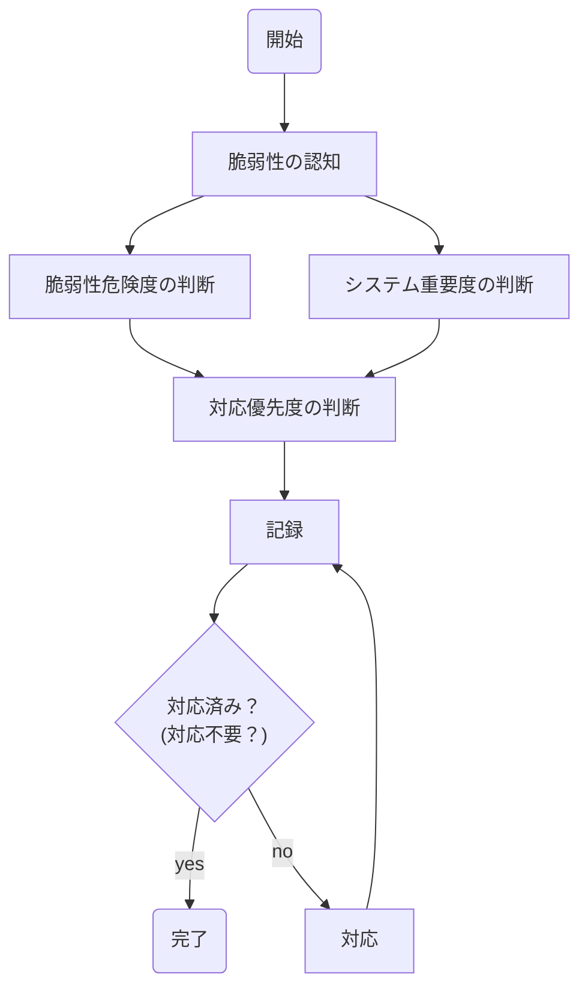

# トリアージガイドライン【テンプレート】

## 1. 総則

### 1.1 本ガイドラインの目的

本ガイドラインは、○○株式会社（以下当社）で新規開発するシステムや運用中のシステムについて、脆弱性診断や外部からの報告などにより実際に脆弱性の存在が発覚した場合に、そのトリアージ（対応優先度の判断）や対応方針を事前に定めておくことによって、迅速かつ正確な脆弱性対応をすることを目的とします。
なお、日々公表されている脆弱性情報の収集や、その影響有無や範囲の確認の手順等については、本ガイドラインの対象外です。

### 1.2 役割と責任

本ガイドラインにおける役割と責任は次のとおりです。

1. CISO
CISOは、当社規程の定めに従い任命されます。
CISOは、当社が開発・運用するすべてのシステムについて、リスク管理の責任を負います。インシデント対応や準備に対してかかる費用についての全決裁権を持つものとします。

2. セキュリティ統括室
セキュリティ統括室は、各事業部門のシステムで発覚した脆弱性や対応状況について、管理・監督する責任を負います。
本ガイドラインで定めた対応方針とは異なる対応を行う必要がある場合、セキュリティ統括室が判断・承認するものとします。

3. システム管理責任者
マネージャ以上の役職者とし、対象システムに応じて所管部門から選出します。
対象システムの管理業務の推進と維持管理に必要な実務全般の判断・承認の責任を負います。
システム管理責任者は、本ガイドラインに沿ってトリアージを行い、脆弱性対応を行い、結果及び対応状況をセキュリティ統括室に報告する責任を負います。

4. システム管理担当者
システム管理責任者の指示のもと、対象システムの管理業務の推進と維持管理に必要な実務作業を担当します。

### 1.3 適用範囲

本ガイドラインは、当社およびグループ会社が開発・運用するすべてのシステムを対象とします。

## 2. トリアージ

### 2.1 トリアージ手順の概要

トリアージを行う際は、まず対象システム区分の判断(2.2参照)と、脆弱性危険度の判断(2.3参照)を行います。これらの2つの判断結果に基づいて、対応優先度の判断(2.4参照)を行います。
対応の優先度が決定すると、それに応じた対応方針や期限が決定(2.5参照)されますので、それに沿って脆弱性の対応を行います。判断結果や対応状況は記録し管理します。

### 2.2 システム区分の判断基準

システムは、その内容や重要性に基づき、3段階の区分に分類します。システム区分は、そのシステムで取り扱う情報や機能に大きな変更が無い限り、変化しない性質のものです。

区分の詳細は下記に定める通り、システムで取り扱うデータによって判断します。

どの区分に該当するかどうかが定かではない場合は、セキュリティ統括室が判断するものとします。

| 区分 | 定義 |
| ---- | -------- |
| A    | 金融データ、顧客情報、特許性を有する製品や技術情報を取り扱うシステム
| B    | 業務データ、従業員の勤怠情報を取り扱うシステム
| C    | ホームページ等で既に公開されている情報を取り扱うシステム

### 2.3 脆弱性危険度の判断基準

脆弱性の危険度は、４段階に分類して評価するものとします。

危険度の詳細は下記に定める通りです。脆弱性報告にCVSS v3基本評価値が記載されている場合は、その値によって危険度を判断します。脆弱性診断ベンダーによっては、CVSSによらない固有の基準で危険度を評価する場合があります。概ね3～4段階の危険度評価がなされることが多いため、その危険度評価を利用します。

報告にあるCVSS基本評価値や危険度評価が実態と著しく乖離している場合、あるいはどの危険度に該当するかどうかが定かではない場合は、セキュリティ統括室が判断するものとします。

| 危険度   | 定義 |
| ------   | ---- |
| Critical | CVSS v3基本値 9.0～10.0 危険度評価Critical、緊急など
| High     | CVSS v3基本値 7.0～8.9 危険度評価High、高など
| Medium   | CVSS v3基本値 4.0～6.9 危険度評価Medium、中など
| Low      | CVSS v3基本値 0.1～3.9 危険度評価Low、低など

### 2.4 対応優先度の判断基準

対応優先度は、4段階に分類するものとします。前述のシステム区分と脆弱性危険度をもとに、次の表に沿って対応優先度を決定します。

||区分A|区分B|区分C|
|--------|----|--|--|
|**Critical**|緊急|高|中|
|**High**    |高  |中|中|
|**Medium**  |中  |中|低|
|**Low**     |中  |低|低|

### 2.5 対応方針の基準

判定した対応優先度に応じて、次の方針及び期限で対応を行います。

この対応方針とは異なる対応を行う必要がある場合、セキュリティ統括室が判断するものとします。

|優先度|対応方針|
|------|--------
|緊急|リリース前の場合は、リリースまでに必ず修正すること 運用中の場合は、即時対応し、日次で対応状況をセキュリティ統括室に報告すること
|高  |リリース前の場合は、リリースまでに必ず修正すること 運用中の場合は、1週間以内に対応すること
|中  |リリース前の場合は、リリースまでに必ず修正すること 運用中の場合は、次回の定期メンテナンス時、遅くとも３カ月以内に対応すること
|低  |次回の機能追加やシステム更改時に対応することとし、現システムでは対応しない

## 3. 対応状況の管理

### 3.1 報告

システム管理責任者は、脆弱性を認知しトリアージした結果及び対応方針・期限について、セキュリティ統括室の指定する管理システムとフォーマットでセキュリティ統括室に報告する必要があります。

また、各脆弱性の対応状況に更新がある場合、適宜セキュリティ統括室に報告するものとします。
ただし対応方針で報告頻度について言及があるものについてはそれに従って報告するものとします。

### 3.2 管理

セキュリティ統括室は、各システムのシステム管理責任者から報告された、脆弱性のトリアージ結果及び対応状況や期限を管理します。

セキュリティ統括室は、本ガイドラインの定める基準や対応方針とは異なる判断を行った場合は、その判断理由を記録する必要があります。

セキュリティ統括室は、対応期限までに対応が完了するようシステム管理責任者をサポートするものとします。

### 3.3 管理システム

脆弱性の対応状況は、社内の標準課題管理システムであるJira(http://jira.intra.example.com/)を利用しチケット管理するものとします。

管理システムでは、次の情報について記録を行います。

|項目|説明|
|----|----|
|脆弱性概要|名称、CVE番号(発番されている脆弱性の場合のみ)|
|対象|ホスト名やURLなど、対象を一意に特定できる情報|
|対応の進捗|現時点の対応状況(未対応/対応済/保留/対応しない など)|
|システム区分|トリアージによって判断したシステム区分|
|脆弱性危険度|トリアージによって判断した脆弱性危険度|
|対応優先度|トリアージによって判断した対応優先度|
|起票日|脆弱性報告を受領した日|
|対応完了日|脆弱性対応が完了した日、または対応しないことを決めた日|
|責任者|システム管理責任者の氏名
|対応期限|できるだけ具体的な日付を指定する|
|対応方針|ソースコードの修正、ソフトウェアのアップグレードなど|
|対応の記録|対応を実施した日、及び実施内容(例外対応が発生した場合はその内容も含む)|

## 4. 附則

### 4.1 改廃
本ガイドラインは、セキュリティ統括室が所管し、改廃はCISOの承認を必要とするものとします。
